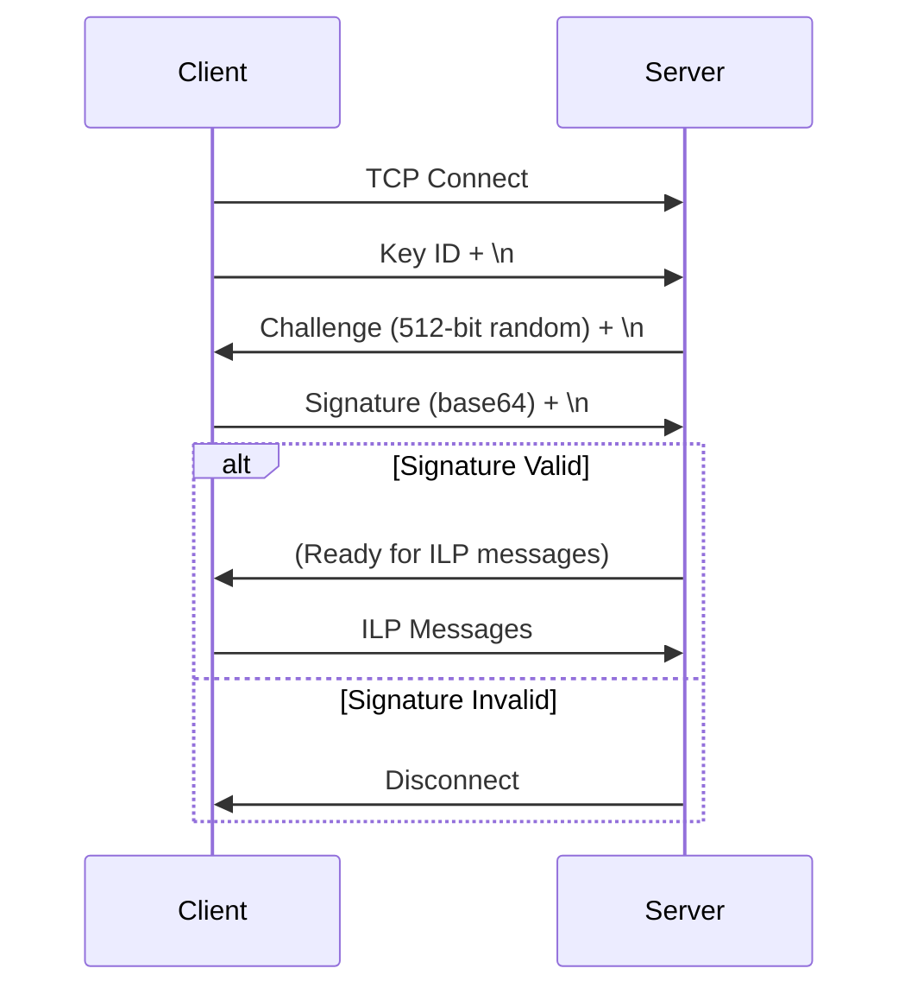

QuestDB supports authentication for ILP over TCP using elliptic curve cryptography. This provides secure, token-based authentication without the overhead of TLS.

## Overview

ILP authentication uses **P-256 elliptic curve** cryptography with a challenge-response protocol:

1. Client sends a **Key ID** (public key identifier)
2. Server responds with a random **challenge** (512-bit nonce)
3. Client signs the challenge with its **private key**
4. Server verifies the signature using the client's **public key**

<Note>
  Authentication is only available for ILP over TCP. UDP does not support authentication due to its connectionless nature.
</Note>

## Configuration

### Enable Authentication

Set the authentication database path in `server.conf`:

```properties
# Enable ILP authentication by specifying auth database path
line.tcp.auth.db.path=/path/to/questdb_ilp_auth.db
```

When `line.tcp.auth.db.path` is set, authentication is **required** for all ILP/TCP connections.

### Authentication Database

The authentication database is a simple text file mapping Key IDs to public keys:

```
# questdb_ilp_auth.db
# Format: keyId <public_key_x> <public_key_y>
#
# Each line contains:
# - Key ID (string identifier)
# - Space separator
# - Public key X coordinate (base64-encoded)
# - Space separator  
# - Public key Y coordinate (base64-encoded)

testUser1 Dt5tbS1dEDMSYfym3fgMv0B99szno-dFc1rYF9t0aac fLOoTlYhcj7xGAZ4gTJOlAVMjI0TH3sQtmJsZcRGwQ
```

## Key Generation

### Generate Authentication Keys

Use OpenSSL to generate a P-256 key pair:

```bash
# Generate private key
openssl ecparam -name prime256v1 -genkey -noout -out client_private.pem

# Extract public key
openssl ec -in client_private.pem -pubout -out client_public.pem

# Display public key coordinates (X, Y)
openssl ec -in client_private.pem -text -noout
```

### Extract Key Coordinates

The public key consists of X and Y coordinates on the P-256 curve:

```bash
# Example output from openssl ec -text
read EC key
Private-Key: (256 bit)
priv:
    ...
pub:
    04:0e:de:6d:6d:2d:5d:10:33:12:61:fc:a6:dd:f8:
    0c:bf:40:7d:f6:cc:e7:a3:e7:45:73:5a:d8:17:db:
    74:69:a7:7c:b3:a8:4e:56:21:72:3e:f1:18:06:78:
    81:32:4e:94:05:4c:8c:8d:13:1f:7b:10:b6:62:6c:
    65:c4:46:c1
ASN1 OID: prime256v1
NISS CURVE: P-256
```

The `pub` section contains:
- First byte: `04` (indicates uncompressed point)
- Next 32 bytes: X coordinate
- Last 32 bytes: Y coordinate

### Convert to Base64

QuestDB requires coordinates in **base64 URL-safe encoding**:

```python
import base64

# X coordinate (32 bytes from pub key)
x_hex = "0ede6d6d2d5d10331261fca6ddf80cbf407df6cce7a3e745735ad817db7469a7"
x_bytes = bytes.fromhex(x_hex)
x_base64 = base64.urlsafe_b64encode(x_bytes).decode('ascii').rstrip('=')
print(f"X: {x_base64}")

# Y coordinate (32 bytes from pub key)
y_hex = "7cb3a84e5621723ef11806788132 4e94054c8c8d131f7b10b6626c65c446c1"
y_bytes = bytes.fromhex(y_hex)
y_base64 = base64.urlsafe_b64encode(y_bytes).decode('ascii').rstrip('=')
print(f"Y: {y_base64}")
```

Output:
```
X: Dt5tbS1dEDMSYfym3fgMv0B99szno-dFc1rYF9t0aac
Y: fLOoTlYhcj7xGAZ4gTJOlAVMjI0TH3sQtmJsZcRGwQ
```

### Add to Authentication Database

Add the Key ID and public key coordinates to the auth database:

```bash
echo "myClientKeyId Dt5tbS1dEDMSYfym3fgMv0B99szno-dFc1rYF9t0aac fLOoTlYhcj7xGAZ4gTJOlAVMjI0TH3sQtmJsZcRGwQ" >> /path/to/questdb_ilp_auth.db
```

## Authentication Protocol

### Connection Flow



### Step-by-Step Protocol

<Steps>
  <Step title="Send Key ID">
    Client sends its Key ID followed by a newline:
    
    ```
    myClientKeyId\n
    ```
  </Step>
  
  <Step title="Receive Challenge">
    Server generates a 512-bit random challenge and sends it as ASCII:
    
    ```
    <512_random_printable_chars>\n
    ```
    
    The challenge consists of printable ASCII characters (0x20 to 0x7E).
  </Step>
  
  <Step title="Sign Challenge">
    Client signs the challenge using ECDSA with SHA-256:
    
    ```python
    from cryptography.hazmat.primitives import hashes
    from cryptography.hazmat.primitives.asymmetric import ec
    from cryptography.hazmat.primitives import serialization
    import base64
    
    # Load private key
    with open('client_private.pem', 'rb') as f:
        private_key = serialization.load_pem_private_key(f.read(), password=None)
    
    # Sign challenge
    signature = private_key.sign(challenge_bytes, ec.ECDSA(hashes.SHA256()))
    signature_base64 = base64.b64encode(signature).decode('ascii')
    ```
  </Step>
  
  <Step title="Send Signature">
    Client sends the base64-encoded signature followed by a newline:
    
    ```
    <base64_signature>\n
    ```
  </Step>
  
  <Step title="Verification">
    Server verifies the signature using the client's public key. If valid, the connection is authenticated and ready for ILP messages.
  </Step>
</Steps>

## Client Implementation

### Python Example

```python
import socket
import base64
from cryptography.hazmat.primitives import hashes, serialization
from cryptography.hazmat.primitives.asymmetric import ec
from cryptography.hazmat.backends import default_backend

class AuthenticatedILPClient:
    def __init__(self, host, port, key_id, private_key_path):
        self.host = host
        self.port = port
        self.key_id = key_id
        
        # Load private key
        with open(private_key_path, 'rb') as f:
            self.private_key = serialization.load_pem_private_key(
                f.read(), password=None, backend=default_backend()
            )
        
        self.sock = None
    
    def connect(self):
        """Establish connection and authenticate."""
        self.sock = socket.socket(socket.AF_INET, socket.SOCK_STREAM)
        self.sock.connect((self.host, self.port))
        
        # Step 1: Send Key ID
        self.sock.sendall(f"{self.key_id}\n".encode())
        
        # Step 2: Receive challenge
        challenge = self._read_line()
        
        # Step 3: Sign challenge
        signature = self.private_key.sign(
            challenge,
            ec.ECDSA(hashes.SHA256())
        )
        signature_base64 = base64.b64encode(signature).decode('ascii')
        
        # Step 4: Send signature
        self.sock.sendall(f"{signature_base64}\n".encode())
        
        print("Authentication successful")
    
    def _read_line(self):
        """Read a line from the socket."""
        line = b''
        while True:
            byte = self.sock.recv(1)
            if not byte or byte == b'\n':
                break
            line += byte
        return line
    
    def send_ilp(self, message):
        """Send ILP message (must end with newline)."""
        if not message.endswith('\n'):
            message += '\n'
        self.sock.sendall(message.encode())
    
    def close(self):
        """Close the connection."""
        if self.sock:
            self.sock.close()

# Usage
client = AuthenticatedILPClient(
    host='localhost',
    port=9009,
    key_id='myClientKeyId',
    private_key_path='client_private.pem'
)

try:
    client.connect()
    
    # Send ILP messages
    import time
    timestamp = int(time.time() * 1_000_000_000)
    client.send_ilp(f"sensors,location=london temperature=23.5 {timestamp}")
    
finally:
    client.close()
```

### Java Example

```java
import java.io.*;
import java.net.Socket;
import java.nio.charset.StandardCharsets;
import java.security.*;
import java.security.spec.PKCS8EncodedKeySpec;
import java.util.Base64;

public class AuthenticatedILPClient {
    private final String host;
    private final int port;
    private final String keyId;
    private final PrivateKey privateKey;
    private Socket socket;
    private BufferedReader reader;
    private BufferedWriter writer;
    
    public AuthenticatedILPClient(String host, int port, String keyId, String privateKeyPath) 
            throws Exception {
        this.host = host;
        this.port = port;
        this.keyId = keyId;
        this.privateKey = loadPrivateKey(privateKeyPath);
    }
    
    private PrivateKey loadPrivateKey(String path) throws Exception {
        // Load PEM private key
        // Implementation depends on your key format
        // This is a simplified example
        KeyFactory keyFactory = KeyFactory.getInstance("EC");
        // ... load and parse PEM file ...
        PKCS8EncodedKeySpec keySpec = new PKCS8EncodedKeySpec(keyBytes);
        return keyFactory.generatePrivate(keySpec);
    }
    
    public void connect() throws Exception {
        socket = new Socket(host, port);
        reader = new BufferedReader(new InputStreamReader(socket.getInputStream()));
        writer = new BufferedWriter(new OutputStreamWriter(socket.getOutputStream()));
        
        // Send Key ID
        writer.write(keyId + "\n");
        writer.flush();
        
        // Read challenge
        String challenge = reader.readLine();
        
        // Sign challenge
        Signature signature = Signature.getInstance("SHA256withECDSA");
        signature.initSign(privateKey);
        signature.update(challenge.getBytes(StandardCharsets.UTF_8));
        byte[] signatureBytes = signature.sign();
        String signatureBase64 = Base64.getEncoder().encodeToString(signatureBytes);
        
        // Send signature
        writer.write(signatureBase64 + "\n");
        writer.flush();
    }
    
    public void sendILP(String message) throws IOException {
        if (!message.endsWith("\n")) {
            message += "\n";
        }
        writer.write(message);
        writer.flush();
    }
    
    public void close() throws IOException {
        if (socket != null) {
            socket.close();
        }
    }
}
```

## Error Handling

### Authentication Failures

<ResponseField name="Invalid Key ID" type="error">
  The Key ID does not exist in the authentication database. Server disconnects immediately.
  
  **Solution**: Verify the Key ID matches an entry in the auth database.
</ResponseField>

<ResponseField name="Invalid Signature" type="error">
  The signature does not match the expected value. Server disconnects immediately.
  
  **Solution**: 
  - Ensure the private key matches the public key in the auth database
  - Verify the challenge is signed correctly with ECDSA-SHA256
  - Check that the signature is base64-encoded
</ResponseField>

<ResponseField name="Connection Timeout" type="error">
  Client did not complete authentication within the timeout period.
  
  **Solution**: Complete the authentication handshake within the configured timeout (default: 300 seconds).
</ResponseField>

### Debugging

Enable detailed logging in `server.conf`:

```properties
# Enable authentication debug logging
log.level=INFO,io.questdb.cutlass.line.tcp.auth=DEBUG
```

Server logs show:
- Key ID received
- Challenge generation
- Signature verification result
- Authentication success/failure

## Security Considerations

<Warning>
  **Protect private keys** - Store private keys securely. Never commit them to version control or share them.
</Warning>

<Warning>
  **Use unique keys per client** - Each client should have its own Key ID and key pair for access control and auditing.
</Warning>

<Note>
  **Challenge entropy** - The server generates challenges using a cryptographically secure random number generator (SecureRandom).
</Note>

<Tip>
  **Key rotation** - Rotate keys periodically. Add new keys to the auth database, update clients, then remove old keys.
</Tip>

### Network Security

While authentication prevents unauthorized access, data is transmitted in plaintext. For sensitive data:

- Use network-level encryption (VPN, SSH tunnel)
- Restrict access using firewalls
- Use TLS proxy (nginx, haproxy) in front of QuestDB

```bash
# SSH tunnel example
ssh -L 9009:localhost:9009 user@questdb-server

# Connect to localhost:9009 (tunneled to remote server)
```

## Authentication Database Management

### Add User

```bash
echo "newUser <public_key_x> <public_key_y>" >> /path/to/questdb_ilp_auth.db
```

### Remove User

```bash
# Remove line with Key ID
sed -i '/^oldUser /d' /path/to/questdb_ilp_auth.db
```

### List Users

```bash
cut -d' ' -f1 /path/to/questdb_ilp_auth.db | grep -v '^#'
```

### Reload Auth Database

Restart QuestDB to reload the authentication database:

```bash
# Graceful restart
kill -TERM $(cat /path/to/questdb.pid)
java -jar questdb.jar start -d /path/to/data
```

<Note>
  Changes to the authentication database require a server restart. Active connections are not affected until they reconnect.
</Note>

## Best Practices

<Tip>
  **Use descriptive Key IDs** - Use meaningful identifiers like `app-name-env` (e.g., `sensor-gateway-prod`) for easier auditing.
</Tip>

<Tip>
  **Implement key rotation** - Rotate keys regularly (e.g., every 90 days) and maintain a process for key distribution.
</Tip>

<Tip>
  **Monitor failed attempts** - Watch server logs for repeated authentication failures, which may indicate attacks.
</Tip>

<Tip>
  **Use connection pooling** - After authentication, reuse connections for multiple writes to avoid repeated handshakes.
</Tip>

## Related Resources

- [ILP Overview](/api/ilp/overview)
- [ILP over TCP](/api/ilp/tcp)
- [Elliptic Curve Cryptography](https://en.wikipedia.org/wiki/Elliptic-curve_cryptography)
- [ECDSA Signature Algorithm](https://en.wikipedia.org/wiki/Elliptic_Curve_Digital_Signature_Algorithm)
