## Column-Oriented Storage

QuestDB stores table data in a columnar format where each column is written to separate files. This architecture provides several advantages for time-series workloads:

### File Layout

For a table named `trades` with columns `timestamp`, `symbol`, `price`, `quantity`:

```
trades/
├── _meta                    # Table metadata
├── _txn                     # Transaction file
├── _cv                      # Column version tracking
├── 2024-03-01/              # Daily partition
│   ├── timestamp.d          # Timestamp column data
│   ├── symbol.d             # Symbol column data
│   ├── symbol.k             # Symbol keys (integer mapping)
│   ├── symbol.v             # Symbol values (string dictionary)
│   ├── price.d              # Price column data
│   └── quantity.d           # Quantity column data
└── 2024-03-02/              # Next partition
    └── ...
```

### Column File Types

Each column type has specific storage characteristics:

**Fixed-width columns** (INT, LONG, DOUBLE, TIMESTAMP):
- Stored in `.d` files as contiguous arrays
- Random access via direct offset calculation: `offset = rowIndex * columnWidth`
- Memory-mapped for zero-copy reads

**Variable-width columns** (STRING, BINARY):
- Data file (`.d`): Contains actual variable-length data
- Index file (`.i`): Contains 8-byte offsets to data file
- Two-level lookup: index[rowIndex] → offset → data

**SYMBOL columns** (optimized strings):
- `.v` file: Dictionary of unique string values
- `.k` file: Integer keys per row (maps to dictionary)
- `.o` file: Offsets into `.v` file
- Enables integer-based comparisons and bitmap indexing

### Memory-Mapped I/O

QuestDB uses memory-mapped files extensively for performance:

```java
// From TableReader.java:90
private ObjList<MemoryCMR> columns;
```

Columns are mapped as `MemoryCMR` (Memory Contiguous Mapped Read) regions (source:core/src/main/java/io/questdb/cairo/TableReader.java:90), allowing the OS to manage page cache transparently.

```java
// From TableWriter.java:191
final ObjList<MemoryMA> columns;
```

Writers use `MemoryMA` (Memory Mapped Appendable) for efficient appends (source:core/src/main/java/io/questdb/cairo/TableWriter.java:191).

## Partitioning Strategy

### Time-Based Partitioning

Tables are partitioned automatically based on the designated timestamp column. The `PartitionBy` class defines supported intervals:

```java
// From PartitionBy.java:46-55
public static final int DAY = 0;
public static final int HOUR = 4;
public static final int MONTH = 1;
public static final int NONE = 3;
public static final int NOT_APPLICABLE = 6;
public static final int WEEK = 5;
public static final int YEAR = 2;
```

Partition intervals: HOUR, DAY, WEEK, MONTH, YEAR, or NONE (source:core/src/main/java/io/questdb/cairo/PartitionBy.java:46-55).

### Partition Directory Naming

Partitions use formatted timestamps as directory names:

```java
// From PartitionBy.java:99-105
public static void setSinkForPartition(CharSink<?> path, int timestampType, int partitionBy, long timestamp) {
    if (isPartitioned(partitionBy)) {
        getPartitionDirFormatMethod(timestampType, partitionBy).format(timestamp, EN_LOCALE, null, path);
        return;
    }
    path.putAscii(DEFAULT_PARTITION_NAME);
}
```

Partition directories are named using formatted timestamps (source:core/src/main/java/io/questdb/cairo/PartitionBy.java:99-105):

- `HOUR`: `2024-03-01T14`
- `DAY`: `2024-03-01`
- `WEEK`: `2024-W09`
- `MONTH`: `2024-03`
- `YEAR`: `2024`

### Benefits of Partitioning

1. **Query pruning**: Skip partitions outside query time range
2. **Parallel processing**: Process multiple partitions concurrently
3. **Data lifecycle**: Drop old partitions for efficient data retention
4. **Write isolation**: Current partition is being written while old partitions are read-only
5. **Backup efficiency**: Copy individual partitions incrementally

## Multi-Tier Storage

QuestDB implements a multi-tier storage pipeline: WAL → Native → Parquet.

### Tier 1: Write-Ahead Log (WAL)

For WAL-enabled tables, writes go through the WAL layer:

```java
// From WalWriter.java:110-118
public class WalWriter extends WalWriterBase implements TableWriterAPI {
    private final ObjList<MemoryMA> columns;
    private final WalWriterMetadata metadata;
    // ...
}
```

The `WalWriter` buffers incoming data in WAL segments before applying to table (source:core/src/main/java/io/questdb/cairo/wal/WalWriter.java:110-118).

**Characteristics**:
- Append-only segments
- Fast writes with minimal fsync
- Multiple concurrent writers
- Asynchronously applied to native storage

### Tier 2: Native Columnar Format

The primary storage format after WAL application:

```java
// From TableWriter.java:155
public class TableWriter implements TableWriterAPI, MetadataService, Closeable {
```

`TableWriter` manages native column files and partitions (source:core/src/main/java/io/questdb/cairo/TableWriter.java:155).

**Characteristics**:
- Column files (`.d`, `.i`, `.k`, `.v`)
- Time-based partitions
- Optimized for query performance
- Supports updates and schema changes

### Tier 3: Parquet Format

Older partitions can be converted to Parquet for:

```java
// From TableReader.java:93-94
private ObjList<PartitionDecoder> parquetPartitionDecoders;
private ObjList<MemoryCMR> parquetPartitions;
```

Parquet partitions are read via `PartitionDecoder` (source:core/src/main/java/io/questdb/cairo/TableReader.java:93-94).

**Characteristics**:
- Better compression ratios
- S3-compatible storage
- Read-only (immutable)
- Industry-standard format

### Storage Tier Transitions

```mermaid
flowchart LR
    A[Ingest] -->|Fast append| B[WAL Segments]
    B -->|ApplyWal2TableJob| C[Native Columns]
    C -->|Convert partition| D[Parquet Files]
    
    B -.->|Read| E[Query Engine]
    C -.->|Read| E
    D -.->|Read| E
    
    style B fill:#a8dadc
    style C fill:#457b9d
    style D fill:#1d3557
```



## Transaction Management

### Transaction File (`_txn`)

The transaction file tracks the current state of the table:

```java
// From TableReader.java:148-152
txFile = new TxReader(ff).ofRO(
    path.trimTo(rootLen).concat(TXN_FILE_NAME).$(),
    timestampType,
    partitionBy
);
```

`TxReader` reads the transaction file for consistent snapshot isolation (source:core/src/main/java/io/questdb/cairo/TableReader.java:148-152).

Contains:
- Transaction number (sequentially incrementing)
- Row counts per partition
- Timestamp min/max per partition
- Column structure version
- Attached/detached partition list

### Column Version File (`_cv`)

Tracks column schema evolution:

```java
// From TableReader.java:142
columnVersionReader = new ColumnVersionReader().ofRO(ff, path.trimTo(rootLen).concat(TableUtils.COLUMN_VERSION_FILE_NAME).$());
```

`ColumnVersionReader` tracks schema changes per partition (source:core/src/main/java/io/questdb/cairo/TableReader.java:142).

Supports:
- Adding/dropping columns
- Column type changes
- Per-partition column versions
- Schema evolution without rewriting data

## Partition Formats

Tables can contain partitions in different formats:

```java
// From TableReader.java:64-67
private static final int PARTITIONS_SLOT_OFFSET_SIZE = 1;
private static final int PARTITIONS_SLOT_OFFSET_NAME_TXN = PARTITIONS_SLOT_OFFSET_SIZE + 1;
private static final int PARTITIONS_SLOT_OFFSET_COLUMN_VERSION = PARTITIONS_SLOT_OFFSET_NAME_TXN + 1;
private static final int PARTITIONS_SLOT_OFFSET_FORMAT = PARTITIONS_SLOT_OFFSET_COLUMN_VERSION + 1;
```

Partition metadata tracks format per partition (source:core/src/main/java/io/questdb/cairo/TableReader.java:64-67).

### Native Format

- Individual column files
- Random read/write access
- Optimal for recent, active data

### Parquet Format

- Single `.parquet` file per partition
- Compressed, columnar
- Read-only, optimal for archival

### Mixed-Format Tables

A single table can have:
- Recent partitions in native format (fast writes)
- Historical partitions in Parquet format (space efficiency)

Query engine transparently handles both formats.

## Compression

### Native Format Compression

- **SYMBOL columns**: Dictionary compression (unique values stored once)
- **Fixed-width columns**: OS-level page compression (if supported)
- **Sparse columns**: Null bitmap reduces storage

### Parquet Format Compression

Parquet partitions use configurable compression:
- SNAPPY (default, balanced)
- GZIP (higher compression)
- ZSTD (modern, efficient)
- LZ4 (fastest)

## Storage Patterns

### Hot-Warm-Cold Architecture

```sql
-- Recent data: WAL + Native (hot)
-- Last 30 days: Native format (warm)
-- Older data: Parquet on S3 (cold)

CREATE TABLE metrics (
    timestamp TIMESTAMP,
    sensor_id SYMBOL,
    value DOUBLE
) TIMESTAMP(timestamp) PARTITION BY DAY WAL;

-- Convert partitions older than 30 days to Parquet
ALTER TABLE metrics CONVERT PARTITION TO PARQUET 
WHERE timestamp < dateadd('d', -30, now());
```

### Deduplication via LATEST ON

For tables with duplicate timestamps per key:

```sql
CREATE TABLE sensors (
    timestamp TIMESTAMP,
    sensor_id SYMBOL,
    temperature DOUBLE
) TIMESTAMP(timestamp) PARTITION BY DAY WAL
DEDUP UPSERT KEYS(timestamp, sensor_id);

-- Query automatically deduplicates
SELECT * FROM sensors
LATEST ON timestamp PARTITION BY sensor_id;
```

## Performance Implications

### Column Pruning

Only read column files needed for query:

```sql
-- Only reads timestamp.d and price.d files
SELECT timestamp, price FROM trades;
```

### Partition Pruning

Skip entire partitions based on query filter:

```sql
-- Only opens partitions for March 2024
SELECT * FROM trades
WHERE timestamp BETWEEN '2024-03-01' AND '2024-03-31';
```

### Parallel Execution

Multiple worker threads process partitions concurrently:

```sql
-- Processes each day's partition in parallel
SELECT symbol, avg(price)
FROM trades
WHERE timestamp >= '2024-01-01'
GROUP BY symbol;
```

## See Also

- [Partitioning](/concepts/partitioning) - Detailed partitioning strategies
- [WAL Architecture](/concepts/wal) - Write-Ahead Log implementation
- [SQL Extensions](/concepts/sql-extensions) - Query capabilities
