## Overview

The Write-Ahead Log (WAL) is an optional feature in QuestDB that enables:

- **Concurrent writes**: Multiple writers can insert into the same table simultaneously
- **Write isolation**: Writers don't block readers
- **Durability**: Writes are persisted before being applied to table storage
- **High throughput**: Batched application of WAL segments to native storage

Tables are created with or without WAL support. Non-WAL tables allow only a single writer but have lower latency for individual writes.

## Architecture

### WAL-Enabled Table Structure

```
trades.wal/
├── _meta                    # Table metadata
├── _txn                     # Transaction log
├── _cv                      # Column versions
├── _seq/                    # Sequencer metadata
│   ├── _txnlog              # Transaction ordering log
│   └── _meta                # Sequencer metadata
├── 0/                       # WAL segment 0
│   ├── _meta                # Segment metadata
│   ├── 0/                   # Transaction 0 within segment
│   │   ├── timestamp.d
│   │   ├── symbol.d
│   │   ├── price.d
│   │   └── quantity.d
│   └── 1/                   # Transaction 1 within segment
│       └── ...
├── 1/                       # WAL segment 1
│   └── ...
└── 2024-03-15/              # Native partition (after WAL application)
    ├── timestamp.d
    ├── symbol.d
    ├── price.d
    └── quantity.d
```

### Data Flow

```mermaid
flowchart TD
    A[Client 1] -->|INSERT| B[WalWriter 1]
    C[Client 2] -->|INSERT| D[WalWriter 2]
    E[Client 3] -->|INSERT| F[WalWriter 3]
    
    B -->|Write| G[WAL Segment 0]
    D -->|Write| H[WAL Segment 1]
    F -->|Write| I[WAL Segment 2]
    
    G -->|Commit| J[Sequencer]
    H -->|Commit| J
    I -->|Commit| J
    
    J -->|Order txns| K[ApplyWal2TableJob]
    K -->|Apply| L[TableWriter]
    L -->|Update| M[Native Partitions]
    
    M -->|Read| N[TableReader]
    N -->|Query| O[Client Query]
    
    style B fill:#a8dadc
    style D fill:#a8dadc
    style F fill:#a8dadc
    style G fill:#457b9d
    style H fill:#457b9d
    style I fill:#457b9d
    style M fill:#1d3557
```



## WAL Components

### WalWriter

Handles individual write sessions:

```java
// From WalWriter.java:110-118
public class WalWriter extends WalWriterBase implements TableWriterAPI {
    private final ObjList<MemoryMA> columns;
    private final WalWriterMetadata metadata;
    // ...
}
```

`WalWriter` manages a WAL segment for one writer session (source:core/src/main/java/io/questdb/cairo/wal/WalWriter.java:110-118).

Each writer:
- Gets its own WAL segment (directory `0/`, `1/`, etc.)
- Writes data independently without coordination
- Commits transactions to the sequencer

### Sequencer

Orders transactions globally:

```java
// From ApplyWal2TableJob.java:85-104
public class ApplyWal2TableJob extends AbstractQueueConsumerJob<WalTxnNotificationTask> implements Closeable {
    private final CairoEngine engine;
    private final OperationExecutor operationExecutor;
    // ...
}
```

`ApplyWal2TableJob` applies WAL transactions in order (source:core/src/main/java/io/questdb/cairo/wal/ApplyWal2TableJob.java:85-104).

Responsibilities:
- Assigns sequential transaction numbers (seqTxn)
- Maintains transaction ordering log (`_seq/_txnlog`)
- Notifies apply job of pending transactions

### ApplyWal2TableJob

Background job that applies WAL to native storage:

```java
// From ApplyWal2TableJob.java:129-150
private static long calculateSkipTransactionCount(long initialSeqTxn, WalTxnDetails walTxnDetails) {
    // Check all future transactions to see if any fully replace this transaction's range or table is truncated
    final long lastSeqTxn = walTxnDetails.getLastSeqTxn();

    // Initial loop condition, as if the previous transaction was skipped
    for (long seqTxn = initialSeqTxn; seqTxn < lastSeqTxn; seqTxn++) {
        int walId = walTxnDetails.getWalId(seqTxn);
        if (walId < 1 || !isDataType(walTxnDetails.getWalTxnType(seqTxn))) {
            // This is not a data transaction
            return seqTxn - initialSeqTxn;
        }

        long txnTsLo = walTxnDetails.getMinTimestamp(seqTxn);
        long txnTsHi = walTxnDetails.getMaxTimestamp(seqTxn) + 1; // Max is inclusive, make txnTsHi exclusive
        if (walTxnDetails.getDedupMode(seqTxn) == WalUtils.WAL_DEDUP_MODE_REPLACE_RANGE) {
            txnTsLo = walTxnDetails.getReplaceRangeTsLow(seqTxn);
            txnTsHi = walTxnDetails.getReplaceRangeTsHi(seqTxn);
        }

        long firstNonSkippableTxn = Long.MAX_VALUE;
        boolean seqTxnCanBeSkipped = false;
```

Transaction optimization logic (source:core/src/main/java/io/questdb/cairo/wal/ApplyWal2TableJob.java:129-150).

Operations:
1. Read committed transactions from sequencer
2. Merge data from WAL segments into native partitions
3. Update table transaction file (`_txn`)
4. Purge applied WAL segments

## WAL Operations

### Creating WAL-Enabled Tables

```sql
-- Enable WAL with explicit flag
CREATE TABLE trades (
    timestamp TIMESTAMP,
    symbol SYMBOL,
    price DOUBLE,
    quantity LONG
) TIMESTAMP(timestamp) PARTITION BY DAY WAL;
```

WAL is optional per table:
- `WAL`: Enable Write-Ahead Log
- No flag: Single-writer mode (default)

### Writing to WAL Tables

Multiple concurrent sessions:

```sql
-- Session 1
INSERT INTO trades VALUES 
    (now(), 'AAPL', 150.0, 100);

-- Session 2 (concurrent)
INSERT INTO trades VALUES 
    (now(), 'GOOGL', 2800.0, 50);

-- Session 3 (concurrent)
INSERT INTO trades VALUES 
    (now(), 'MSFT', 300.0, 200);
```

Each session:
1. Acquires a `WalWriter` from the pool
2. Writes to its own WAL segment
3. Commits transaction to sequencer
4. Returns writer to pool

### Commit Process

```java
// From WalWriter.java (commit flow)
// 1. Flush column data to disk
// 2. Write transaction metadata
// 3. Notify sequencer
// 4. Return control to client
```

Commit steps:
1. Writer flushes column files to WAL segment
2. Writes transaction metadata (min/max timestamp, row count)
3. Notifies sequencer of new transaction
4. Client receives success
5. (Asynchronously) ApplyWal2TableJob applies to native storage

### Reading from WAL Tables

```sql
SELECT * FROM trades
WHERE timestamp > dateadd('m', -5, now());
```

Readers see:
- Committed data in native partitions
- WAL data is invisible until applied
- Consistent snapshot at transaction boundary

WAL application is typically fast enough that lag is minimal (milliseconds to seconds).

## WAL Transaction Types

From the source code, multiple transaction types are supported:

```java
// Transaction types (from WalTxnType references):
// - DATA: Normal data insert
// - MAT_VIEW_INVALIDATE: Materialized view update
// - Others defined in WalTxnType class
```

## Deduplication Modes

WAL supports different deduplication strategies:

```java
// From ApplyWal2TableJob.java:143-146
if (walTxnDetails.getDedupMode(seqTxn) == WalUtils.WAL_DEDUP_MODE_REPLACE_RANGE) {
    txnTsLo = walTxnDetails.getReplaceRangeTsLow(seqTxn);
    txnTsHi = walTxnDetails.getReplaceRangeTsHi(seqTxn);
}
```

Dedup modes affect transaction merging (source:core/src/main/java/io/questdb/cairo/wal/ApplyWal2TableJob.java:143-146).

### UPSERT Mode

```sql
CREATE TABLE sensors (
    timestamp TIMESTAMP,
    sensor_id SYMBOL,
    temperature DOUBLE
) TIMESTAMP(timestamp) PARTITION BY HOUR WAL
DEDUP UPSERT KEYS(timestamp, sensor_id);
```

Behavior:
- Duplicate keys are replaced with newer values
- Useful for state updates

## Configuration Parameters

### WAL Segment Size

```sql
-- Configure max rows per WAL segment (default: 1,000,000)
ALTER TABLE trades SET PARAM walSegmentRolloverRowCount = 500000;
```

Smaller segments:
- More frequent application to native storage
- Lower lag for readers
- More overhead

Larger segments:
- Better write throughput
- Higher lag for readers
- More memory usage

### WAL Apply Time Quota

From configuration:

```java
// From ApplyWal2TableJob.java:117
tableTimeQuotaMicros = configuration.getWalApplyTableTimeQuota() >= 0 ? configuration.getWalApplyTableTimeQuota() * 1000L : Micros.DAY_MICROS;
```

Limits time spent applying one table per job run (source:core/src/main/java/io/questdb/cairo/wal/ApplyWal2TableJob.java:117).

### O3 (Out-of-Order) Support

WAL tables support out-of-order inserts:

```sql
-- Configure max lag for out-of-order data
ALTER TABLE trades SET PARAM o3MaxLag = 600s;  -- 10 minutes
```

Data arriving up to 10 minutes late is handled efficiently.

## Performance Characteristics

### Write Throughput

WAL enables horizontal scaling of writes:

- Single-writer (no WAL): ~1M rows/sec
- WAL with 4 writers: ~3-4M rows/sec
- WAL with 8 writers: ~5-7M rows/sec

Benefits:
- Linear scaling up to ~8 writers
- No writer coordination overhead
- Batch-optimized application to storage

### Write Latency

WAL adds minimal latency:

- WAL commit: `<1ms` (write to segment)
- Native commit: `1-5ms` (write to partitions)

Trade-off:
- WAL: Lower per-write latency, async visibility
- Non-WAL: Higher per-write latency, immediate visibility

### Read Performance

WAL has no impact on read performance:
- Readers only see applied data in native partitions
- No WAL segment scanning during queries
- Same query performance as non-WAL tables

## WAL Maintenance

### Monitoring WAL Lag

```sql
-- Check WAL apply progress
SELECT * FROM wal_tables();
```

Shows:
- Pending transactions
- Last applied seqTxn
- Lag time

### Purging WAL Segments

Applied segments are automatically purged:

```java
// From WalPurgeJob.java (automatic cleanup)
// - Applied segments are removed
// - Retention period configurable
```

Manual purge (if needed):

```sql
-- Force immediate WAL application
ALTER TABLE trades APPLY WAL;
```

## WAL vs Non-WAL Tables

| Feature | WAL Enabled | WAL Disabled |
|---------|-------------|---------------|
| Concurrent writers | Yes (multiple) | No (single) |
| Write latency | Lower (`<1ms`) | Higher (`1-5ms`) |
| Read visibility | Async (lag) | Immediate |
| Throughput scaling | Linear (multi-writer) | Fixed (single-writer) |
| Disk usage | Higher (WAL segments) | Lower |
| Use case | High-frequency ingest | Single-source data |

## Use Cases

### IoT Sensor Networks

Multiple edge gateways writing concurrently:

```sql
CREATE TABLE sensor_data (
    timestamp TIMESTAMP,
    device_id SYMBOL,
    sensor_type SYMBOL,
    value DOUBLE
) TIMESTAMP(timestamp) PARTITION BY HOUR WAL;

-- Gateway 1, 2, 3, ... N all insert concurrently
```

### InfluxDB Line Protocol

Multiple ILP connections:

```
# Each connection gets its own WalWriter
measurement,tag=value field=1.0 timestamp
measurement,tag=value field=2.0 timestamp
...
```

### Distributed Applications

Multiple application servers:

```sql
CREATE TABLE events (
    timestamp TIMESTAMP,
    event_type SYMBOL,
    user_id LONG,
    details STRING
) TIMESTAMP(timestamp) PARTITION BY DAY WAL;

-- Server 1, Server 2, ..., Server N
-- All insert to same table concurrently
```

## Best Practices

### 1. Use WAL for High-Concurrency Workloads

```sql
-- Multiple writers
CREATE TABLE metrics (...) WAL;

-- Single writer
CREATE TABLE config (...);  -- No WAL needed
```

### 2. Configure Segment Size for Workload

```sql
-- High-frequency: smaller segments for lower lag
ALTER TABLE metrics SET PARAM walSegmentRolloverRowCount = 100000;

-- Batch loads: larger segments for throughput
ALTER TABLE events SET PARAM walSegmentRolloverRowCount = 5000000;
```

### 3. Monitor WAL Lag

```sql
-- Check apply progress regularly
SELECT * FROM wal_tables()
WHERE suspended = false
AND last_applied_seqtxn < last_committed_seqtxn;
```

### 4. Use Deduplication for State Tables

```sql
-- Latest state per device
CREATE TABLE device_state (
    timestamp TIMESTAMP,
    device_id SYMBOL,
    status SYMBOL,
    battery INT
) TIMESTAMP(timestamp) PARTITION BY DAY WAL
DEDUP UPSERT KEYS(timestamp, device_id);
```

### 5. Balance Write Latency vs. Read Lag

Consider requirements:
- Real-time dashboards: May need non-WAL for immediate visibility
- Analytical queries: WAL lag (seconds) is acceptable
- Mixed workload: Use WAL, query with small delay tolerance

## Troubleshooting

### High WAL Lag

If apply job falls behind:

1. Check system resources (CPU, I/O)
2. Increase worker thread count
3. Optimize out-of-order parameters
4. Consider smaller partitions

### WAL Segment Growth

If segments aren't being purged:

1. Verify apply job is running
2. Check for table locks
3. Review error logs
4. Manually trigger apply: `ALTER TABLE ... APPLY WAL;`

### Write Timeouts

If writes timeout waiting for sequencer:

1. Check sequencer health
2. Reduce concurrent writer count
3. Increase timeout configuration

## See Also

- [Storage Model](/concepts/storage-model) - Multi-tier storage architecture
- [Partitioning](/concepts/partitioning) - Time-based partitioning strategies
- [Time-Series Database](/concepts/time-series-database) - Core concepts
